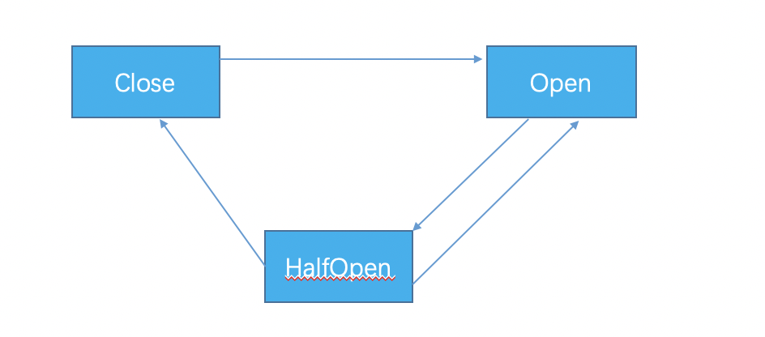

# resilience4j

  resilience4j是一个类似Netflix Hystrix，用于容错处理的类库。和Hystrix相比，resilience4j更加轻量，只依赖[vavr](http://www.vavr.io/)。

## CircuitBreaker
  断路器实际上可以看成一个带有统计功能的状态机，CircuitBreaker根据统计的api调用成功率进行断路器状态的自动流转。
  . 
  
  初始状态为Close，状态流转的条件:
  + Close-> Open：手动调用api或者接口失败率大于阈值(CircuitBreakerConfig.failureRateThreshold，默认50)。该状态流转的判断在接口每次调用失败的时候触发。
  + Open -> HalfOpen: 在Open状态下的时间超过一定时间(CircuitBreakerConfig.waitDurationInOpenState，默认60s)。流转到HalfOpen状态有两种触发方式：
    * Open状态下每次调用circuitBreaker.isCallPermitted()方法都会去check上述条件
    * 如果打开自动流转到HalfOpen开关(CircuitBreakerConfig.automaticTransitionFromOpenToHalfOpenEnabled)，当断路器流转到Open状态时会启动一个定时器，延时CircuitBreakerConfig.waitDurationInOpenState后自动流转到HalfOpen状态。
  + HalfOpen -> Close: 接口失败率小于等于阈值(CircuitBreakerConfig.failureRateThreshold),在HalfOpen状态下每次接口调用成功的时候触发。
  + HalfOpen -> Open: 接口失败率大于阈值(CircuitBreakerConfig.failureRateThreshold),在HalfOpen状态下每次接口调用失败的时候触发。
  
### 统计
   区别于Hystrix中基于时间窗口的统计，resilience4j使用一个环形的BitSet来进行统计，永远统计最近XX个调用的状态。这样的好处是对于不同访问量的接口都可以提供一个统一的配置视图，因为统计数据不再以时间维度来滚动。另外相比Hystrix中使用布尔数组的方式，BitSet更节省内存。
   
#### RingBitSet
   一个环形的BitSet，环形意味着只统计最近size次的调用情况。当某次调用失败的时候，对应bit位的值设置为1，成功则将对应bit位的值设置为0。BitSet中维护有一个long类型的数组来维护bit位。通过将bitIndex右移6位(除64)来获取该bit位对应的long对象在数组中的位置。1L << bitIndex之后在64bit的bit序列中，bitIndex位置的值位1其余位置为0，
   所以如果要设置的值为1，则将该位置对应的long值与bitMask按位或，如果需要设置的值位0，则对bitMask取反再与对应的long值按位与。
   ```
   int set(int bitIndex, boolean value) {
           int wordIndex = wordIndex(bitIndex);
           long bitMask = 1L << bitIndex;
           int previous = (words[wordIndex] & bitMask) != 0 ? 1 : 0;
           if (value) {
               words[wordIndex] |= bitMask;
           } else {
               words[wordIndex] &= ~bitMask;
           }
           return previous;
       }
   ```